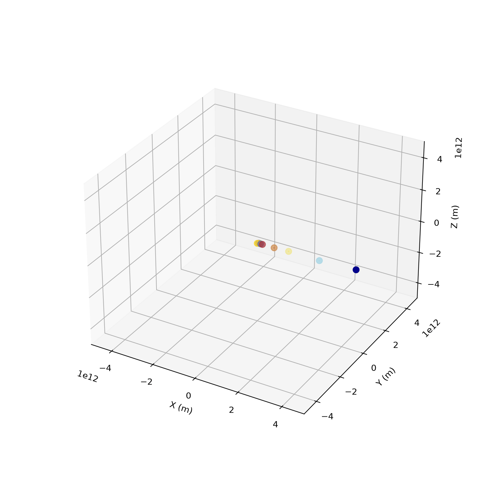

# Orbis


Simulates how planets move and interact using Newton's law of gravity.

## Math

### Calculate force
The force can be derived using Newton's Law of Universal Gravitation.
```math
F_{1 \to 2} = \frac{Gm_1m_2}{r_{1 \to 2}^2}
```
where:
- F is force
- G is universal gravitational constant
- m is mass
- r is distance

```math
F_{\text{net}_k} = \sum_i^{n | n \neq k}{\frac{Gm_km_i}{r_{k \to i}^2}\hat{ki}}
```

### Calculate acceleration 
The acceleration can be derived using Newton's Second Law of Motion.
```math
\begin{aligned}
    F_{\text{net}} &= ma \\
    \frac{F_{\text{net}}}{m} &= a \\
    a &= \frac{F_{\text{net}}}{m}
\end{aligned}
```
where:
- $F$ is net force
- $m$ is mass
- $a$ is acceleration

### Calculate velocity
The velocity can be derived using the relationship between acceleration and velocity.
```math
\begin{aligned}
    a &= \frac{dv}{dt} \\
    adt &= dv \\
    dv &= adt \\
    v_f - v_i &= adt \\
    v_f &= adt + v_i \\
\end{aligned}
```
where:
- $a$ is acceleration
- $v_f$ is final velocity
- $v_i$ is initial velocity
- $dt$ is change in time


### Calculate position
The position can be derived using the relationship between velocity and position.
```math
\begin{aligned}
    v &= \frac{dx}{dt} \\
    vdt &= dx \\
    dx &= vdt \\
    x_f - x_i &= vdt \\
    x_f &= vdt + x_i
\end{aligned}
```
where:
- $v$ is velocity
- $x_f$ is final position
- $x_i$ is initial position
- $dt$ is change in time

### Direction and distance
Suppose $u(u_1, u_2, u_3)$ and $v(v_1, v_2, v_3)$.

#### Calculate direction
```math
\vec{uv} = (v_1 - u_1, v_2 - u_2, v_3 - u_3)
```

#### Calculate distance
```math
\lVert \vec{uv} \rVert = \sqrt{(v_1 - u_1)^2 + (v_2 - u_2)^2 + (v_3 - u_3)^2}
```

#### Calculate unit direction
```math
\hat{uv}=\frac{\vec{uv}}{\lVert \vec{uv} \rVert}
```

## Research

| Body    | Mass (kg)     | Distance (m)      | Velocity (m/s)  | Vertical Distance (m)    | Inclination |
|---------|---------------|-------------------|-----------------|--------------------------|-------------|
| Sun     | 1.9885e30     | 0                 | 0               | 0                        | 0           |
| Mercury | 3.3011e23     | 5.79e10           | 4.74e4          | 7.1e9                    | 7.00°       |
| Venus   | 4.8675e24     | 1.082e11          | 3.502e4         | 6.4e9                    | 3.39°       |
| Earth   | 5.972e24      | 1.495978707e11    | 2.978e4         | 0                        | 0°          |
| Mars    | 6.417e23      | 2.279e11          | 2.4007e4        | 7.4e9                    | 1.85°       |
| Jupiter | 1.898e27      | 7.785e11          | 1.307e4         | 1.8e10                   | 1.30°       |
| Saturn  | 5.683e26      | 1.4335e12         | 9.69e3          | 6.2e10                   | 2.49°       |
| Uranus  | 8.681e25      | 2.8725e12         | 6.81e3          | 3.9e10                   | 0.77°       |
| Neptune | 1.024e26      | 4.4951e12         | 5.43e3          | 1.4e11                   | 1.77°       |

## Contributions
This repository is maintained by @jonahfrancisbenedicto
1. **Fork** the Project
2. **Create** your Feature Branch (`git checkout -b feature/custom-feature`)
3. **Commit** your Changes (`git commit -m 'Add custom feature'`)
4. **Push** to the Branch (`git push origin feature/custom-feature`)
5. **Open** a Pull Request

## License
This repository is licensed under the [MIT License](./LICENSE).
